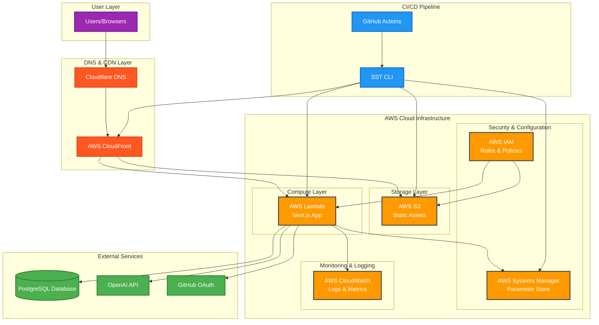
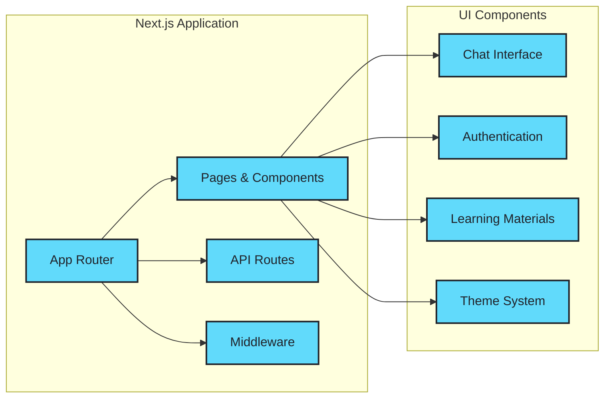
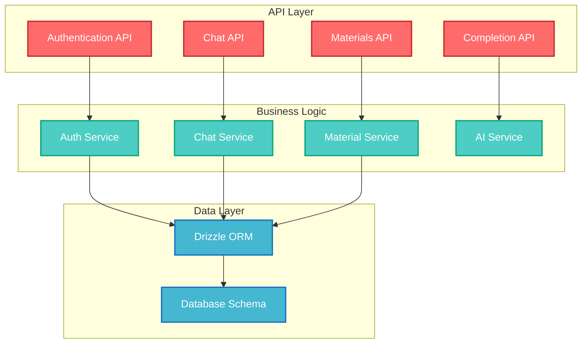
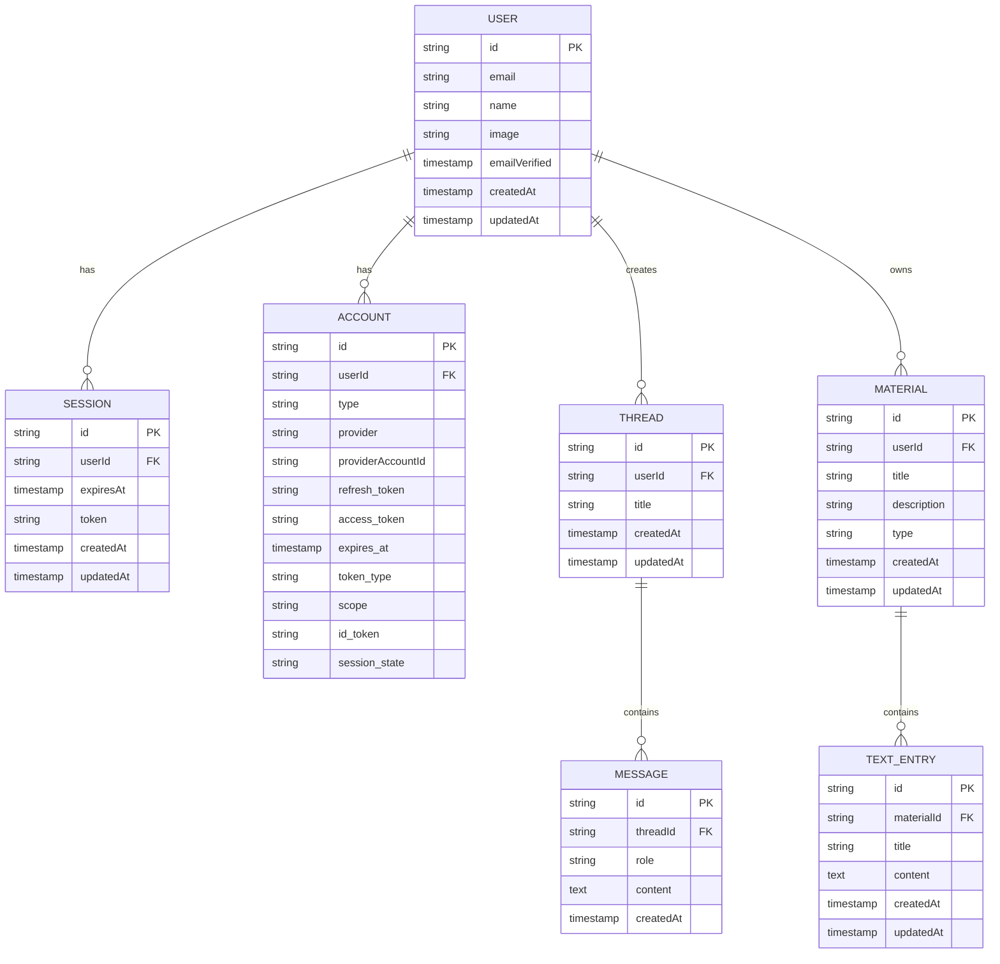
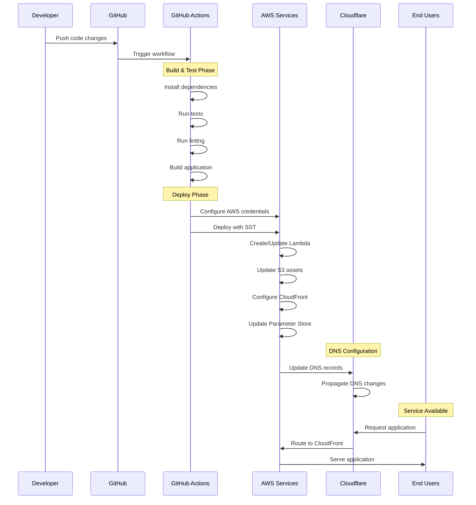
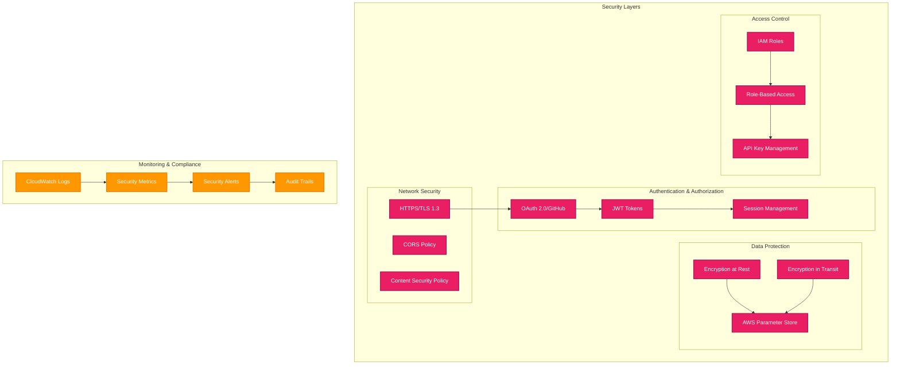
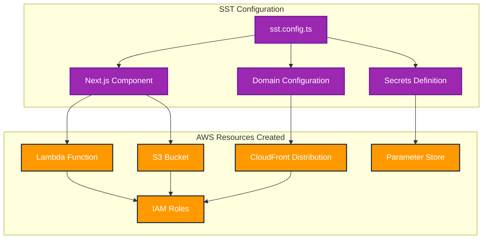
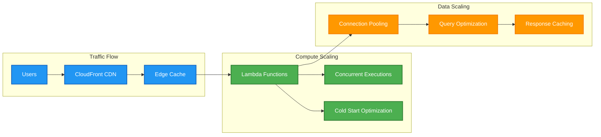
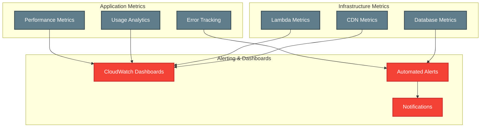

# BrainBytes Deployment Architecture Diagram

## Architecture Overview

This document describes the deployment architecture for BrainBytes, a serverless AI-powered learning platform deployed on AWS using SST (Serverless Stack).

## High-Level Architecture Diagram

## Detailed Component Architecture

### 1. Frontend Layer

### 2. Backend Services Architecture

### 3. Database Schema Architecture

## Deployment Flow Architecture

## Security Architecture

## Infrastructure as Code

### SST Configuration Structure

## Performance and Scaling

### Auto-Scaling Architecture

## Monitoring and Observability

## Architecture Benefits

### Scalability

- **Serverless**: Automatic scaling based on demand
- **Global CDN**: Worldwide content distribution
- **Database**: Optimized connection pooling

### Reliability

- **Multi-AZ**: AWS multi-availability zone deployment
- **Redundancy**: Multiple layers of redundancy
- **Monitoring**: Comprehensive monitoring and alerting

### Security

- **Encryption**: End-to-end encryption
- **Access Control**: Fine-grained access control
- **Compliance**: Security best practices implemented

### Cost Efficiency

- **Pay-per-Use**: Only pay for actual usage
- **Optimization**: Automated cost optimization
- **Monitoring**: Cost tracking and alerts

## Future Architecture Considerations

### Planned Enhancements

1. **Multi-Region**: Deploy across multiple AWS regions
2. **Microservices**: Break down into smaller services
3. **Event-Driven**: Implement event-driven architecture
4. **AI/ML Pipeline**: Dedicated ML infrastructure
5. **Real-time**: WebSocket support for real-time features
